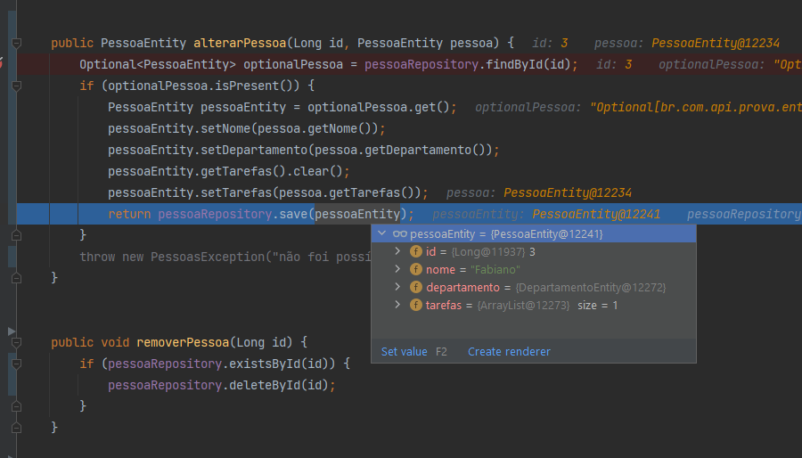

# prova-consultoria

## Parte 1:


### Subir o Docker-compose:

```sh
docker-compose up -d
```

### Derrubar o Docker-compose:

```sh
docker-compose down
```

### Spring Security:
```sh
Adicionar um usuário na tabela users para evitar o 403 (Unauthorized) 
```

### Desativar o Spring Security:
```sh
Para desativar e remover e evitar o 403 (Unauthorized), comente as classes listadas abaixo e as dependencias do spring-security:

User.java
UserRespository.java
AuthenticationController.java
SecurityFilter.java
TokenService.java
SecurityConfig.java
 
```


### Abrir o Swagger (Comando 1):
```sh
http://localhost:8085/swagger-ui/index.html#/
```

### Abrir o Swagger Json (Comando 2):
```sh
http://localhost:8085/v3/api-docs
```


## Os Selects utilizados no projeto encontram-se dentro das Migrations: 
**src/main/java/resources/db/migration**


## Desafio 2
| X   | Y  |   Z | Resposta |
|:----|:--:|----:|---------:|
| 3   | 2  |  11 |        B |
| 150 | 3  | 455 |        C |
| 7   | -1 |  -2 |        A |
| -2  | 5  |  -5 |        A |
| 50  | 3  | 155 |        C |


Os demais desafios encontram-se presentes dentro do código, mais especificamente no path: **com.example.demo**


### Select Objetivo:
- Lista pessoas trazendo nome, departamento, total horas gastas nas tarefas:

  @Query(value = "SELECT p.nome, d.titulo, " +
  "CONCAT(FLOOR(SUM(IFNULL(TIME_TO_SEC(t.duracao), 0))/3600), 'h ', " +
  "MOD(SUM(IFNULL(TIME_TO_SEC(t.duracao), 0))/60, 60), 'm') " +
  "FROM pessoas p " +
  "LEFT JOIN tarefas t ON p.id = t.id_pessoa_alocada " +
  "LEFT JOIN departamentos d ON p.id_departamento = d.id " +
  "GROUP BY p.nome, d.titulo", nativeQuery = true)
  List<TarefaEntity> findAllByPessoasComTotalHorasGastas();


### Select Objetivo:
- Busca pessoas por nome e período, retorna média de horas gastas por tarefa:

  @Query("SELECT p.nome, AVG(COALESCE(t.tempoDiasDuracao, 0) / 3600.0) " +
  "FROM PessoaEntity p " +
  "LEFT JOIN p.tarefas t " +
  "WHERE p.nome = :nome " +
  "GROUP BY p.nome")
  List<Object[]> buscarMediaHorasPorTarefaPorNome(String nome);


### Select Objetivo: 
- Lista 3 tarefas que estejam sem pessoa alocada com os prazos mais antigos:

    @Query("SELECT t FROM TarefaEntity t WHERE t.pessoaAlocada is NULL")
    List<TarefaEntity> findFirst3TarefasSemPessoaAlocada();


### Select Objetivo:
- Lista departamento e quantidade de pessoas e tarefas

  @Query(value = "SELECT d.id AS departamento_id, COUNT(t.id) AS quantidade_tarefas " +
  "FROM pessoas p " +
  "LEFT JOIN tarefas t ON p.id = t.id_pessoa_alocada " +
  "LEFT JOIN departamentos d ON p.id_departamento = d.id " +
  "WHERE d.id = :departamentoId " +
  "GROUP BY d.id", nativeQuery = true)
  List<DepartamentoEntity> listarDepartamentosComQuantidades(@Param("departamentoId") Long departamentoId);


### Select Objetivo:
- Select que retorne título da tarefa, prazo, se tiver pessoa alocada na tarefa exibir como “Encaminhado para + nome do pessoa” caso contrário “Pendente” e total de horas que essa pessoa já gastou. Ordenar por prazo decrescente;


    @Query("SELECT\n" +
            "    t.titulo AS titulo_tarefa,\n" +
            "    t.prazo AS prazo,\n" +
            "    CASE\n" +
            "        WHEN t.pessoaAlocada IS NOT NULL THEN CONCAT('Encaminhado para ', p.nome)\n" +
            "        ELSE 'Pendente'\n" +
            "    END AS status,\n" +
            "    SUM(TIME_TO_SEC(COALESCE(t.duracao, '00:00:00'))) / 3600 AS total_horas_gastas\n" +
            "FROM\n" +
            "    TarefaEntity t \n" +
            "LEFT JOIN\n" +
            "    PessoaEntity p ON p.id = t.pessoaAlocada.id\n" +
            "ORDER BY\n" +
            "    t.prazo DESC\n")


## Algumas chamadas dos endpoints:
### POST api/gerenciamento/pessoas


### PUT api/gerenciamento/pessoas/{id}


### GET api/gerenciamento/pessoas/obter-todos
